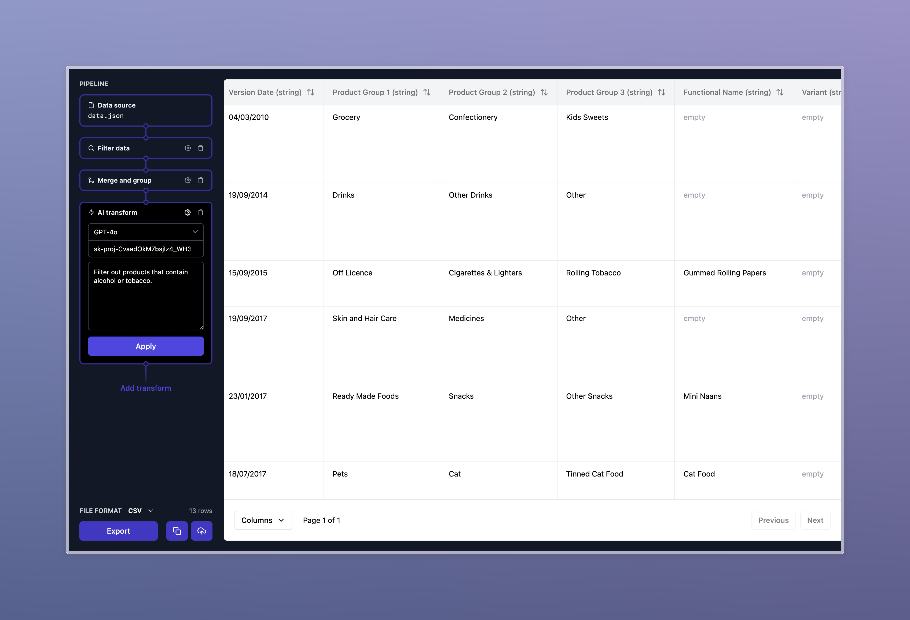

# 🦸‍ CSV Hero

[](https://github.com/tschoffelen/csv-hero/actions/workflows/test.yml)
[](./LICENSE)

**A simple web app to transform CSV, Excel, JSON and XML files.**

CSV Hero helps you to format, filter and convert tabular data files. Need to generate a CSV from a JSON file, but only want to include rows that contain the word 'cow'? CSV Hero can help with that.

**[csvhero.app](https://csvhero.app)**



## Development

To work on this project locally, run the following commands in the project root:

```shell
yarn
yarn start
```

## Continuous Integration

This project uses GitHub Actions for continuous integration. Every push to the main branch and pull requests will trigger a CI workflow that runs Cypress tests to ensure the application works correctly.

### Running Tests Locally

To run Cypress tests locally:

1. Install dependencies:

   ```
   yarn
   ```

2. Start the application:

   ```
   yarn start
   ```

3. Run the tests in Cypress GUI:

   ```
   yarn cypress:open
   ```

4. Or run the tests headlessly:
   ```
   yarn cypress:run
   ```

## Deployment

This project is automatically deployed when new code is pushed to the `master` branch using Vercel.
